Chrome Extension 开发概况
======================
Chrome extension 即 Chrome 扩展插件插件。 Chrome 插件非常丰富，不局限于添加 script/html，还可以实现远程登录，代理等非常复杂的功能。
下来介绍几个常用的 Chrome 插件看看 Chrome 插件可以实现怎样的功能，然后介绍下如何插件开发。

常用插件
-----------------------
1. [Proxy Switchy](https://chrome.google.com/webstore/detail/caehdcpeofiiigpdhbabniblemipncjj)
	快速切换系统代理，并能更具规则自动切换。
	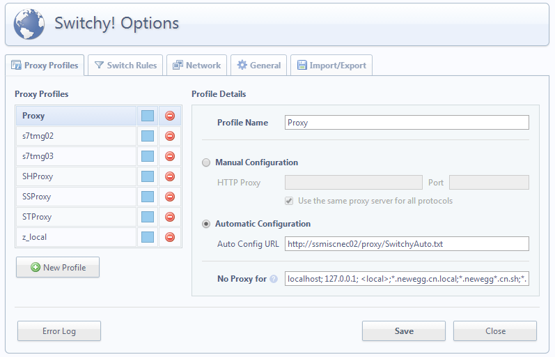
2. [e 淘 插件（如意淘）](https://chrome.google.com/webstore/detail/%E5%A6%82%E6%84%8F%E6%B7%98%EF%BC%9A%E5%90%8C%E6%AC%BE%E6%AF%94%E4%BB%B7%EF%BC%8C%E4%BB%B7%E6%A0%BC%E6%9B%B2%E7%BA%BF%EF%BC%8C%E9%99%8D%E4%BB%B7%E6%8F%90%E9%86%92/keigpnkjljkelclbjbekcfnaomfodamj)
	多网站比较，商品历史价格
	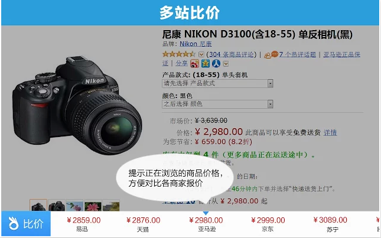
3. [Chrome RDP](https://chrome.google.com/webstore/detail/chrome-rdp/cbkkbcmdlboombapidmoeolnmdacpkch)
	用 Chrome 远程登录服务器
	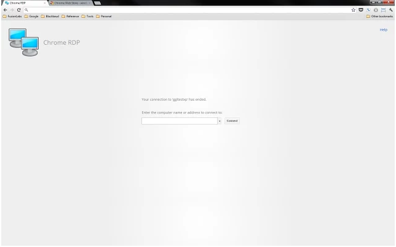


Extension 概况
-----------------------
先看一个官方示例，示例是一个很简单的功能，点击右上角的图片下拉浏览 flickr 的图片。
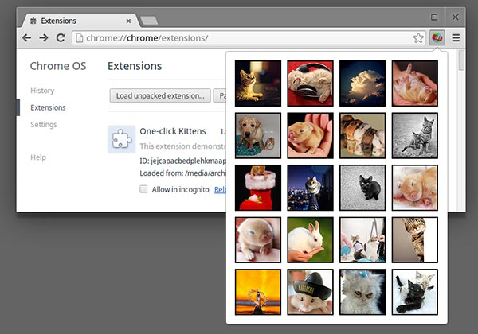

这个插件涉及到两个功能，`browser action` 和 `popup`。

- Browser Action
	显示 icon
	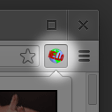
- Popup
	对应 popup.html
	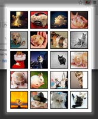

这样一个插件开发首先需要定义一个清单即 manifest.json 文件，告诉 Chrome 需要加载那些文件，需要的功能和对应的权限。
```
{
  "manifest_version": 2,

  "name": "One-click Kittens",
  "description": "This extension demonstrates a browser action with kittens.",
  "version": "1.0",

  "permissions": [
    "https://secure.flickr.com/"
  ],
  "browser_action": {
    "default_icon": "icon.png",
    "default_popup": "popup.html"
  }
}
```

## Chrome 插件结构
Chrome 插件结构主要分为5个部分
- Browser Action
- Page Action
- Background
- Content Script
- Popup

### Browser Action
浏览器右上角属于 Browser Action 区域，执行区域输入 extension。Browser Action 除了图标外，还有`Badge`，`ToolTip`，`Popup`。通过相应的 API 可以对他们进行操作。
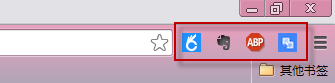

相应API
- setIcon()
- setTitle()
- setBadageText()

### Page Action
Chrome 浏览器里面的`RSS`图片Page Action 区域。点击之心相应的功能。
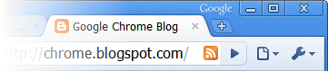

### Background
Background 是 Chrome Extension 执行的后台功能，比如监听有Popup、ContentScript发送到消息。

### Content Script
Content Script 是在插入在 page 中执行的。Page Script可以在 manifest 配置在`document_start`，`document_idle`，`document_end`时触发。注意，Content Script是在 Page 中执行的，所以和 Extension 是两个区域，即时是同一个插件。

### Popup
Popup 是在 Browser Action 区域中点击弹出。
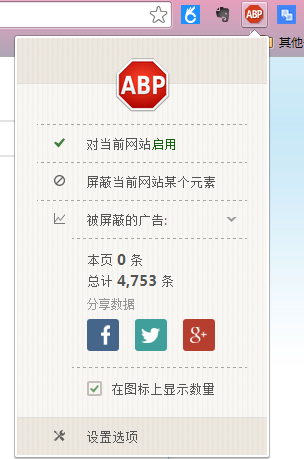


开发
-----------------------
### Chrome 目录结构
|- manifest.json
|- js/ (option)
|- css/ (option)
|- images/ (option)

*除了 manifest.json 文件外其他都是自定的*
*注意开发权限都在在 manifest.json 配置*
*新版 Popup 不能直接嵌入 script，包括 A 链接href中的 javascript:void(0)*


调试
-----------------------
### Background
进入扩展设置，点击 Background
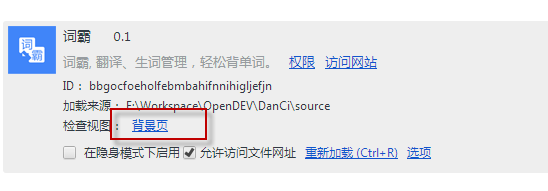

### Popup
右键 Browser Action 图标，点击“审查弹出内容”
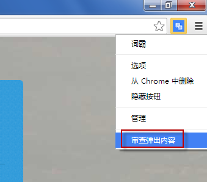

### Page Content
Page Content 是 inject 在 Page 中执行的，调试自已是 F12 Console调试。


示例 - 词霸
-----------------------
[github 下载地址](https://github.com/pisceanfoot/DanCi)

- Mainifest.json
	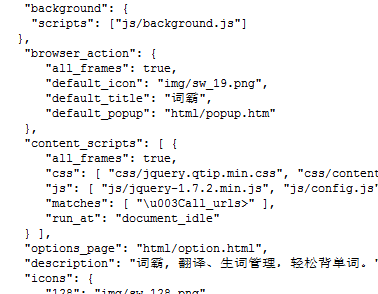
- Popup.html
	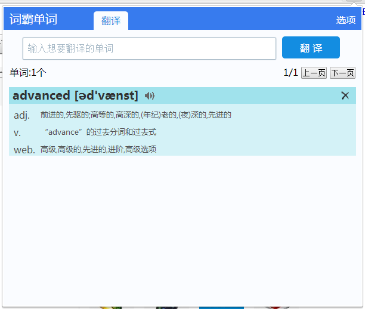
- Content Script
	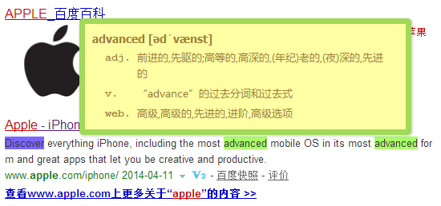
- Option.html	
	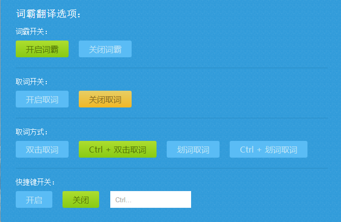


参考资料
-----------------------
[Getting Started: Building a chrome extension](https://developer.chrome.com/extensions/getstarted)
[chrome api](https://developer.chrome.com/extensions/api_index)
