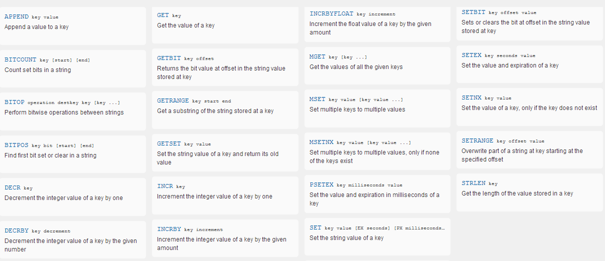
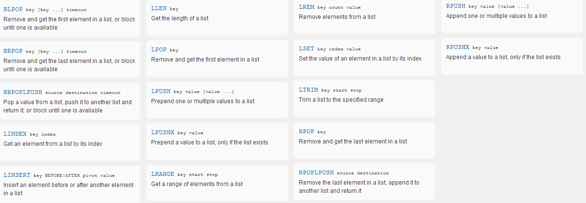
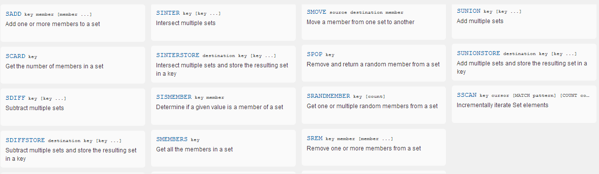
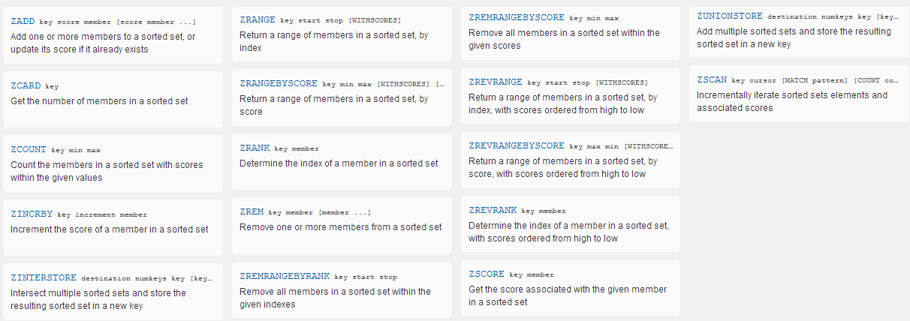
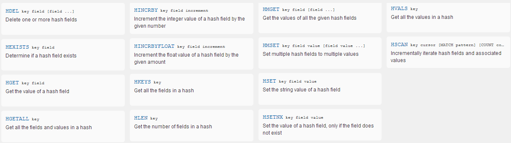
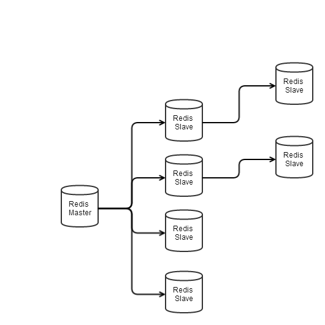

初识 Redis
=======================
Redis 是个内存数据库，同时具备将数据保存到磁盘的功能，因此可以达到非常高的读写速度。除了具备 key-value外，还具有其他几个复杂的数据类型如：List, Hash。Redis在单个操作上提供了原子性操作，事物处理等。

## 数据类型	
- String
- List
- Set
- SortedSet
- Hash

### String
String 是Redis的基础类型，最大长度512M。String可以是任意类型，文字、数字、甚至是图片。有趣的是当String为数字时，甚至可以对String类型进行Increase或Decrease操作。

操作 String 类型数据和 memcached 类似
```	
set mykey "redis value"
get mykey
	redis value
```
对 String 进行 incre 操作
```	
set mykey1 1
incre meykey1 1
(integer) 2

incrby mykey1 100
(integer) 102
```

String 支持批量操作
```
set mykey1 mykey
set mykey2 yourkey
get mykey1 mykey2
1) "mykey"
2) "yourkey"
```

[](images/datatype_string.png)
[String 详细 Command 列表](http://redis.io/commands/#string "String Command 列表")

### List
Redis List 类型 C 语言中数据结构 Linked List 或双向链表。因此向 List 头部或尾部增加元素是相当迅速的。
Redis 单个 List 中元素最大限制为 2^32 -1 (4294967295, 超过40亿)。

通过 `LPUSH` 向列表头部添加元素
```
lpush key 1
lpush key 2
lpush key 3
lrange key 0 -1
1) "3"
2) "2"
3) "1"
```
通过 `RPUSH` 向列表尾部添加元素
```
rpush key 1
rpush key 2
rpush key 3
lrange key 0 -1
1) "1"
2) "2"
3) "3"
```

`lrange` 后面的参数闭合区间，上面的列子等价于lrange [0 -1]。 `lrange 0 2` 和 `lrange 0 -1` 是等价的。 -1 表示最右边一位, -2 表示为倒数第二位, 以为类推。

List 相关的有趣应用

* 在 SNS 中使用 `LPUSH` 添加数据，使用 `LRANGE` 前 N 个最近发言的人，而不需要任何排序。
* 使用 `LPUSH` 和 `LTRIM`， 是 List 中永远保持最近的几条数据。

[](images/datatype_list.png)
[List Command 列表](http://redis.io/commands#list)

### Set
Redis Set 是一个无序的唯一的集合，最大支持 2^32 - 1 个元素。

`SAdd` 添加元素
```
	sadd key 1
	sadd key 2
	sadd key 3
	smembers key
	1) "1"
	2) "2"
	3) "3"
	sadd key 3
	smembers key
	1) "1"
	2) "2"
	3) "3"
```
Set 支持对多个 Set 集合进行union, intersection 或 difference 等操作。

Set 应用

* 商品评论 Tag，smembers product_10000:tag, 直接获取所有商品相关 tag， 且不需要排重。
* 网络唯一 IP 统计

[](images/datatype_set.png)
[Set Command 列表](http://redis.io/commands#set)

### SortedSet
Sorted Set 和 Set 类似，区别在于 Sorted Set 关联一个 score， 并按照 score 排序。

使用 `zadd`添加元素
```
zadd key 2 a
zadd key 3 b
zadd key 0 c
zrange key 0 -1
1) "c"
2) "a"
3) "b"

zrevrange key 0 -1
1) "b"
2) "a"
3) "c"
```
[](images/datatype_sortedset.png)
[SortedSet Command 列表](http://redis.io/commands#sorted_set)
### Hash
Redis Hash 是 Redis 最有意思的类型。Hash 结构包括 filed-value， 一个 Hash 值可以包含若干个 filed-vlaue对。
```
key
	field-value
	field-value
	field-value
	field-value
```
Hash 同样最大支持 2^32 - 1 个元素。Redis Hash执行对key下的某个field进行操作。

```
hset key field value
hset key field1 value1
hgetall key
1) "field"
2) "value"
3) "field1"
4) "value1"

hmset key field1 value2
hgetall key
1) "field"
2) "value"
3) "field1"
4) "value2"
```
[](images/datatype_hash.png)
[Hash Command 列表](http://redis.io/commands#hash)

## 使用方式
* 缓存
> Redis 可以当缓存使用，是每个 key 都增加过期时间，或者设置过期策略 LRU 等。

* 持久存储
> Redis 操作内存数据同时保存到磁盘。未来版本将支持 cluster 功能。

## 同步
Redis 采用 Mater-Slave 结构，Slave 可以连接另一个 Slave 的做为数据源接收数据。
Redis 同步采用异步方式，由 Slave 周期性的发起同步数据。默认情况下 Slave 是只读的，做为 Master 的 LB。



当 Slave 链接上 Master 后并发起 `SYNC` 同步，Master 可以继续服务并在后台准备同步数据，将数据发送到 Slave。
Slave 此时可以继续使用过期数据或者返回 error。

Master-Slave 断开链接后 Master 将完整的数据同步给 Slave，在 2.8版本之后可以同步 Partial Data `PSYNC` (前提是 master id 和 replication offset 在 backlog 中)。

**正常情况下 Redis 采用 Partial Replication`PSYNC`**


```
slave command:
saveof 192.168.0.100 9379
```
## 一致性
由于 Redis 同步采用异步方式，对 Master 进行写操作但不能确保数据真正保存到 Slave 上。 Redis2.8 支持“Allow writes only with N attached replicas”。意思是在 M 时间内必须有 N 台 Slave 连接，否则写失败。

** 所以 Redis 不保证完全的一致性，在这段时间内 Master 异常可能会导致数据丢失 **

## 故障恢复
Redis 使用 Redis Sentinel 应用程序监控 Redis 状态实现故障自动转移(unstable)。 

其他方式：

- [zookeeper](http://fr.slideshare.net/ryanlecompte/handling-redis-failover-with-zookeeper)
- [jedis](https://github.com/hamsterready/jedis-sentinel-pool/blob/master/src/main/java/pl/quaternion/SentinelBasedJedisPoolWrapper.java)

## 限制
1. Memory
	* Redis 是内存数据库 Dataset 的大小必须小于内存大小，或者作为缓存使用。
2. 网络
	* Redis Replication 可能会使用 full sync，同步到时间取决于内存数据的大小和网络带宽。

## 优缺点比较
### 优点
- 内存操作 fast write & fast read
- replication，支持 Master-Slave 负载。未来将支持 Cluster/Partition 功能。
- 故障自动转移，但目前还在开发中

### 缺点
- 受限于内存
- Full sync，大数据量在多个 DC 同步将非常困难
- 为了支持自动故障转移，客户端可能很复杂