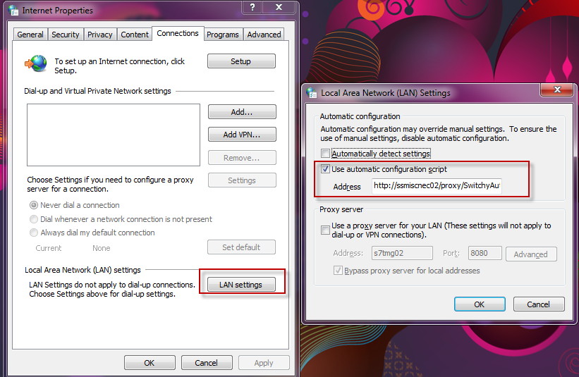
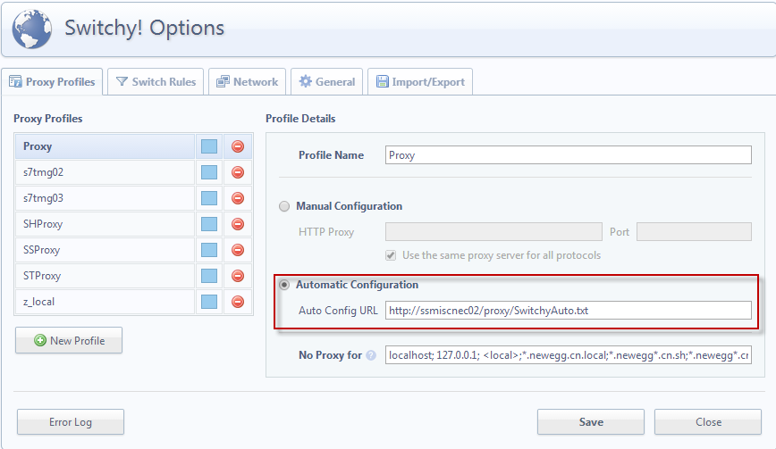

Proxy auto-config (PAC)
------------------------

## 介绍

From:[wikipedia](http://zh.wikipedia.org/wiki/%E4%BB%A3%E7%90%86%E8%87%AA%E5%8A%A8%E9%85%8D%E7%BD%AE)

>	代理自动配置（英语：Proxy auto-config，简称PAC）是一种网页
	浏览器技术，用于定义浏览器该如何自动选择适当的代理服务器来访问	一个网址。
>	一个PAC文件包含一个JavaScript形式的函数“FindProxyForURL
	(url, host)”。这个函数返回一个包含一个或多个访问规则的字符串。用户代理根据这些规则适用一个特定的代理其或者直接访问。 当一个代理服务器无法响应的时候，多个访问规则提供了其他的后备访问方法。 浏览器在访问其他页面以前，首先访问这个PAC文件。PAC文件中的URL可能是手工配置的，也可能是是通过网页的网络代理自发现协议（Web Proxy Autodiscovery Protocol）自动配置的。

上述是 [wikipedia](http://zh.wikipedia.org/) 对 PAC的解释。顾名思义，PAC可以使用浏览访问某个网址时自动判断并使用特定的代理服务器。
PAC 文件包含了一个 JavaScript 方法执行具体的判断。

## 示例
```
 	function FindProxyForURL(url, host) {
      // our local URLs from the domains below example.com don't need a proxy:
      if (shExpMatch(url,"*.example.com/*"))                  {return "DIRECT";}
      if (shExpMatch(url, "*.example.com:*/*"))               {return "DIRECT";}
 
      // URLs within this network are accessed through 
      // port 8080 on fastproxy.example.com:
      if (isInNet(host, "10.0.0.0",  "255.255.248.0"))    {
         return "PROXY fastproxy.example.com:8080";
      }
 
      // All other requests go through port 8080 of proxy.example.com.
      // should that fail to respond, go directly to the WWW:
      return "PROXY proxy.example.com:8080; DIRECT";
   }
```

上述示例有四个判断条件：
1. url 符合规则 “*.example.com/*”是不是用代理（Direct 直接访问）
2. url 符合规则 “*.example.com:*/*”是不是用代理（Direct 直接访问）
3. 当访问 host 为特定子网时，使用 “fastproxy” 代理，格式为“PROXY fastproxy.example.com:8080”
4. 其他类型的请求使用“proxy”代理。

示例中还给出了设置代理的格式：
- DIRECT          -- 直接访问，不知用代理服务器
- PROXY host:port -- 使用指定代理服务器host，端口port

## 具体应用
假设我们现在有2个代理服务器，我们使用正则来判断 URL，然后通过特定的判断执行具体使用哪个代理服务器。

### 需求：
1. 访问国内网络是希望不是用代理直接访问
2. 访问 facebook 时使用美国代理
3. 访问其他网站 X 时使用新加坡代理

### 代码
因为 PAC 是通过 JavaScript 执行的，所以第一步添加正则判断方法方便使用。

- 第一步添加 `正则判断方法`
	```
		function regExpMatch(url, pattern) {
			try { return new RegExp(pattern).test(url); } catch(ex) { return false; }
		}
	```
- 第二步在 `FindProxyForURL` 中实现规则判断
	```
		function FindProxyForURL(url, host) {
			var APROXY = 'PROXY STPROXY:8080';
			var BPROXY = 'PROXY SSPROXY:8080';

			if (regExpMatch(url, 'facebook')) return APROXY;
			if (regExpMatch(url, 'websitex')) return BPROXY;

			return 'DIRECT';
		}
	```

### 保存文件
将上述代理保存为任意格式的文本文件，最好可以网络访问，所有电脑使用一套规则。

### 浏览器设置


### Chrome 插件设置


当然可以仅设置系统代理，所有浏览器都使用系统代理。 使用任何浏览器都会使用上述规则。

## 更加复杂的设置
```
function regExpMatch(url, pattern) {
	try { return new RegExp(pattern).test(url); } catch(ex) { return false; }
}
// SSFIREWALL

function FindProxyForURL(url, host) {
	var LocalProxy = 'PROXY localhost:8060';
	var FiddlerProxy = 'PROXY localhost:8888';
	var SHPROXY = 'PROXY SHPROXY:8080';
	var STPROXY = 'PROXY STPROXY:8080';
	var SSPROXY = 'PROXY SSPROXY:8080';
	var S7TMG02 = 'PROXY S7TMG02:8080';
	var TESTPROXY = 'PROXY 10.16.50.188:8080';

	var PRD_TEST = 'PROXY 127.0.0.1:9999';


       var urllower = url.toLowerCase();
       if((urllower.substring(0,5)=="rtsp:") ||
	   (urllower.substring(0,6)=="rtspt:") ||
	   (urllower.substring(0,6)=="rtspu:") ||
	   (urllower.substring(0,4)=="mms:") ||
	   (urllower.substring(0,5)=="mmst:") ||
	   (urllower.substring(0,5)=="mmsu:")){
		if (regExpMatch(url, 'enmms\.chinabroadcast\.cn')) return SSPROXY ;	
		else  return S7TMG02;
	}

	if (regExpMatch(url, 'cm\.newegg\.com\.cn')) return 'PROXY 127.0.0.1:9999';
	if (regExpMatch(url, '127\.0\.0\.1')) return 'DIRECT';
	if (regExpMatch(url, 'localhost|.cn.local')) return 'DIRECT';
    if (regExpMatch(url, '\d\.newegg\.cn')) return 'DIRECT';
    if (regExpMatch(url, '\d\.newegg\.com\.cn')) return 'DIRECT';

	if (regExpMatch(url, 'intranet')) return 'DIRECT';
	if (regExpMatch(url, 'newegg\d')) return 'DIRECT';
	if (regExpMatch(url, '\.neweggimages\.cn\.sh')) return 'DIRECT';
	if (regExpMatch(url, '\.neweggimages\.com\.cn')) return 'DIRECT';
	if (regExpMatch(url, 'cn.sh|cn.qa|ipp')) return 'DIRECT';
	
	if (regExpMatch(url, 'tudou\.com')) return SHPROXY;
	if (regExpMatch(url, 'youku\.com')) return SHPROXY;
	if (regExpMatch(url, 'v.163.com')) return SHPROXY;

	if (regExpMatch(url, 'newegg\.cn')) return SSPROXY;

	if (regExpMatch(url, '.+2\.newegg\.com\.cn')) return STPROXY;
	if (regExpMatch(url, 'doubleclick')) return SSPROXY;
	if (regExpMatch(url, 'sinaimg\.cn')) return SSPROXY;

	if (regExpMatch(url, '180\.169\.')) return 'DIRECT';
	if (regExpMatch(url, 'Crl2006')) return 'DIRECT';
	if (regExpMatch(url, '10\.16\.')) return 'DIRECT';


	if (regExpMatch(url, 'mail\.google\.com')) return S7TMG02;
	if (regExpMatch(url, 'mail-archives\.apache\.org')) return S7TMG02;
	if (regExpMatch(url, 'i3\.sinaimg\.cn')) return S7TMG02;
	if (regExpMatch(url, 'news\.sina\.com\.cn')) return S7TMG02;
	if (regExpMatch(url, 'auto\.sina\.com\.cn')) return S7TMG02;
	if (regExpMatch(url, 'tools\.google\.com')) return S7TMG02;

	if (regExpMatch(url, 'mail-archive\.com')) return S7TMG02;
	if (regExpMatch(url, 'slideshare\.net')) return S7TMG02;
	if (regExpMatch(url, 'geekswithblogs\.net')) return S7TMG02;
	if (regExpMatch(url, 'fastly\.net')) return S7TMG02;
	if (regExpMatch(url, 'baidupcs\.com')) return S7TMG02;

	if (regExpMatch(url, '\.taobao\.com')) return SSPROXY;
	if (regExpMatch(url, '\.tmall\.com')) return SSPROXY;
	if (regExpMatch(url, 'google\.com\.hk')) return SSPROXY;

	if (regExpMatch(url, 'gmail|mail\.google')) return 'DIRECT';
	if (regExpMatch(url, 'mail\.sina\.com\.cn')) return 'DIRECT';
	if (regExpMatch(url, 'newegg\.com\.cn')) return 'DIRECT';

	if (regExpMatch(url, '(mars.corp)|(mistfs)|ssvos01')) return 'DIRECT';
	if (regExpMatch(url, 'tenpay.com')) return 'DIRECT';
	if (regExpMatch(url, 'slideshare')) return 'DIRECT';
	if (regExpMatch(url, 'fbcdn')) return 'DIRECT';
	
	if (regExpMatch(url, 'docs\.google\.com')) return FiddlerProxy;
	if (regExpMatch(url, 'gaopeng')) return LocalProxy;
	if (regExpMatch(url, 'douban')) return LocalProxy;

	if (regExpMatch(url, 'gtimg\.com')) return SSPROXY;
	if (regExpMatch(url, 'wordpress.com')) return STPROXY;
	if (regExpMatch(url, 'qq')) return STPROXY;
	if (regExpMatch(url, 'translate\.google\.cn')) return STPROXY
	if (regExpMatch(url, 'google\.com|sites.google.com')) return STPROXY;
	if (shExpMatch(url, '*://appengine.google.com/*')) return STPROXY;
	if (regExpMatch(url, 'infoq')) return STPROXY;
	if (regExpMatch(url, 'blogspot')) return STPROXY;
	if (regExpMatch(url, 'facebook')) return SSPROXY;
	if (regExpMatch(url, 'youku')) return STPROXY;
	if (regExpMatch(url, '\.tw')) return STPROXY;
	if (regExpMatch(url, 'pan\.baidu\.com')) return SHPROXY;
	
	if (regExpMatch(url, 'youtube\.com')) return SHPROXY;
	if (regExpMatch(url, 'ytimg\.com')) return SHPROXY;
	if (regExpMatch(url, 'qd\.cache\.baidupcs\.com')) return SHPROXY;
	

	return STPROXY;
}
```